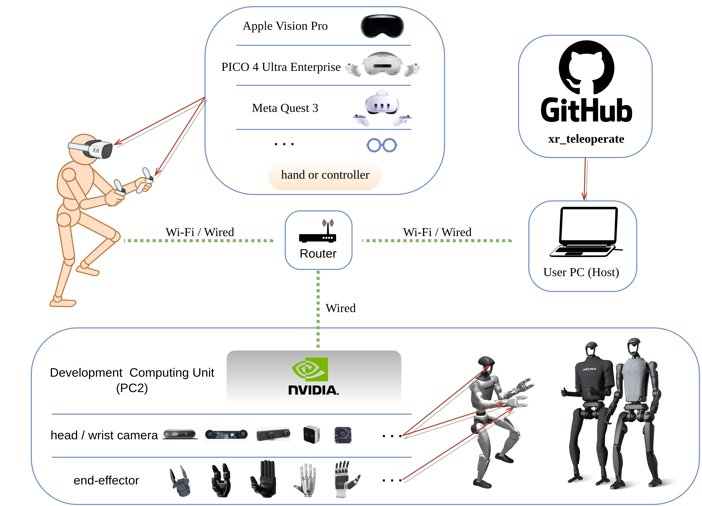
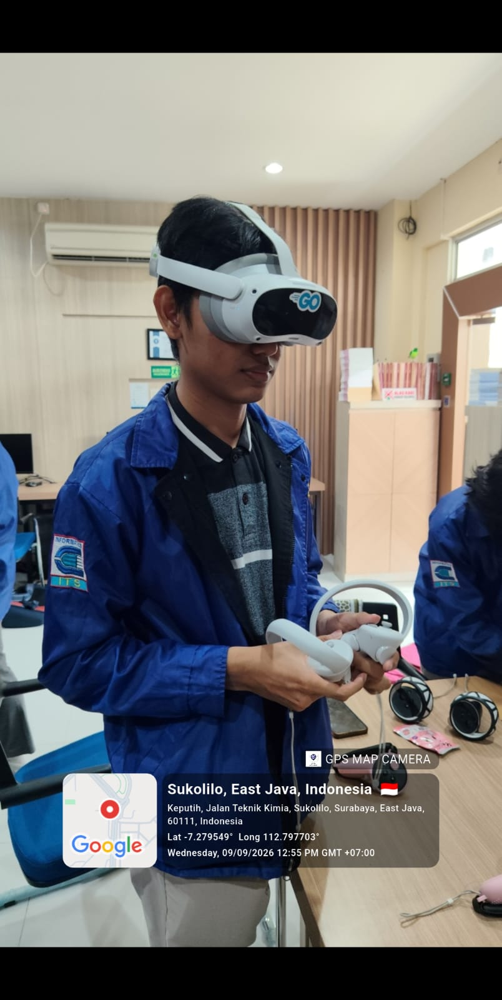

# XR Teardown — Unitree `xr_teleoperate`

**5054241001 — Ustu Bina Syahdiba** · S1 AI Engineering · Individual Assignment 1

|                          |                                                                                                                                        |
| ------------------------ | -------------------------------------------------------------------------------------------------------------------------------------- |
| Subject                  | `xr_teleoperate` XR teleoperation framework for humanoid robots formerly known as `avp_teleoperate`                                         |
| Publisher / manufacturer | Unitree Robotics                                                                                                                       |
| Release or major update  | `v1.6` July 2026 (release note dated `2026.7.29`). Project first published 2024                                                          |
| Platform(s)              | Meta Quest 3 / 3S, PICO 4 Ultra Enterprise, Apple Vision Pro; robot side Unitree G1, H1, H2, R1   |
| How I examined it        | Documentation and source code, plus my own static measurement of the code at a pinned commit. No headset or robot was used.              |
| Hands-on date(s)         | Documentation and source only. Measurement run 8 Sep 2026 against commit `817fb00` (7 Sep 2026).                                         |

> **My claim in one sentence.** `xr_teleoperate` looks like a teleoperation tool but it is really a data-collection tool for training robot AI and I thought this was a teleoperation tool for a moment.

---

## 1. Device class

It targets 6-DoF standalone inside-out headsets with hand tracking and a WebXR browser (Quest 3 and 3S, PICO 4 Ultra Enterprise, Apple Vision Pro). The headset runs no robotics code at all. Connection is made by opening a URL in the headset browser and the entire control stack lives on a separate x86-64 Linux host plus the robot's onboard PC2. The headset contributes exactly three things:

1. Head and hand pose
2. A stereo display surface 
3. Wi-Fi

There are three display modes: `immersive`, `ego`, and `pass-through`. They differ in how much of the operator's view is taken up by the robot's camera feed versus their own real room.

- **`immersive`**: The operator sees only the robot's stereo camera feed, filling their whole view. It looks just like VR. The cost is that the operator cannot see their own surroundings at all.
- **`ego`**: The operator sees their real room with the robot's camera feed shown only as a small window instead of filling their view.
- **`pass-through`**: The operator sees only their real room and the robot's camera feed is not shown.

The hardware document notes a stereo head camera "provides more immersion", and depth judgement for grasping depends on it. Because gaze is unavailable, v1.6 changed the default to a "head-yaw-relative arm reference" the operator's head yaw substitutes for where they are looking. This works, but the operator must turn their head to reorient the arm frame, and cannot glance. On Apple Vision Pro where eye tracking exists, the framework still does not use it because the WebXR path is the easiest path across all three vendors.

## 2. Input modality

**What the user does:** [The modalities actually used — controllers, hand tracking, gaze-and-pinch, voice, gesture, dwell, physical props, room-scale locomotion.]

**Why this and not that:** [Argue the choice against a named alternative the product did not take. What did it buy, and what did it give up?]

**Where it fails:** [At least one concrete failure mode — precision, arm fatigue, discoverability, occlusion, lighting, standing vs seated, small rooms, accessibility.]

**What I would change:** [One substantiated remedy. Say why it would work, not just that it would be nicer.]

## 3. Use of AI

[Go through the pipeline and report only what you can evidence. Delete the rows you find nothing for — an honest short table beats a padded one.]

| Where                | What it does                                                    | On-device or cloud | Cost it carries                                   | Source + the line I am relying on |
| -------------------- | --------------------------------------------------------------- | ------------------ | ------------------------------------------------- | --------------------------------- |
| Perception           | [hand/body pose, scene mesh, relocalisation]                    |                    | [latency / battery / thermal / network / privacy] | [link] — "[quote the sentence]"   |
| Content              | [text- or image-to-3D, upscaling, texture synthesis]            |                    |                                                   | [link] — "[quote]"                |
| Interaction          | [STT, TTS, LLM agent, translation]                              |                    |                                                   | [link] — "[quote]"                |
| Rendering & delivery | [foveation, frame interpolation, super-resolution, split/cloud] |                    |                                                   | [link] — "[quote]"                |

> Every row needs the **quoted sentence**, not just the link. A claim with a bare URL behind it is an unsupported claim.

[Then the paragraph that actually earns the marks: what is the AI *for* here — is it load-bearing, or is it decoration? If you concluded there is no meaningful AI, this is where you show where you looked and why absence is plausible.]

## 4. Impact

**Intended benefit:** [Concrete enough that someone could check whether it is true.]

**Privacy, security, or ethics:** [Tie this to sensor data the device really captures — hand and body pose, room scans and scene meshes, passthrough camera frames, voice. What is collected, where does it go, and who is exposed — including bystanders who never consented.]

**Accessibility / human factors:** [Who cannot use this, and why? Height, one-handed use, vision, motion sensitivity, cybersickness, language, cost.]

## 5. What I take from this

[Two or three sentences. What does this teardown tell you about where XR design is heading — or where it is stuck? Do not summarise the sections above.]

---

## References

1. [Primary source — developer documentation, specification, technical paper, or your own measurement. At least one of these is required.]
2. [Author/Publisher. (Year). *Title*. URL — accessed DD Mon 2026]
3. [ ]
4. [ ]

## Figure credits

- Fig. 1 — [my own screenshot, Quest 3, 8 Sep 2026 / source and licence]
- Fig. 2 — [ ]
- Fig. 3 — [ ]

## AI-assistance disclosure

**What I used, and for what.** [Name the tools and the tasks — e.g. "Claude to tighten the prose in §2; all sources located and read by me." If you used none, write "None."]

### What I disagreed with my AI assistant about

[One paragraph, and it is marked. Where did the tool tell you something you decided was wrong, shallow, or unsupported — and what did you do instead? Be specific: name the claim, name your reason. If you used no tools, write instead about a source you decided not to trust, and why.]